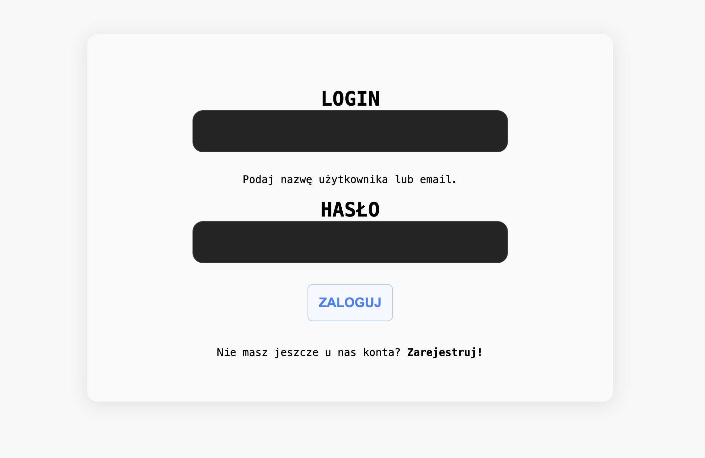
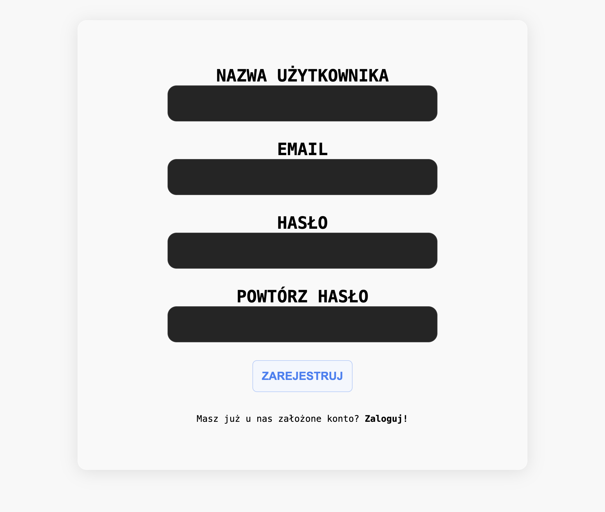
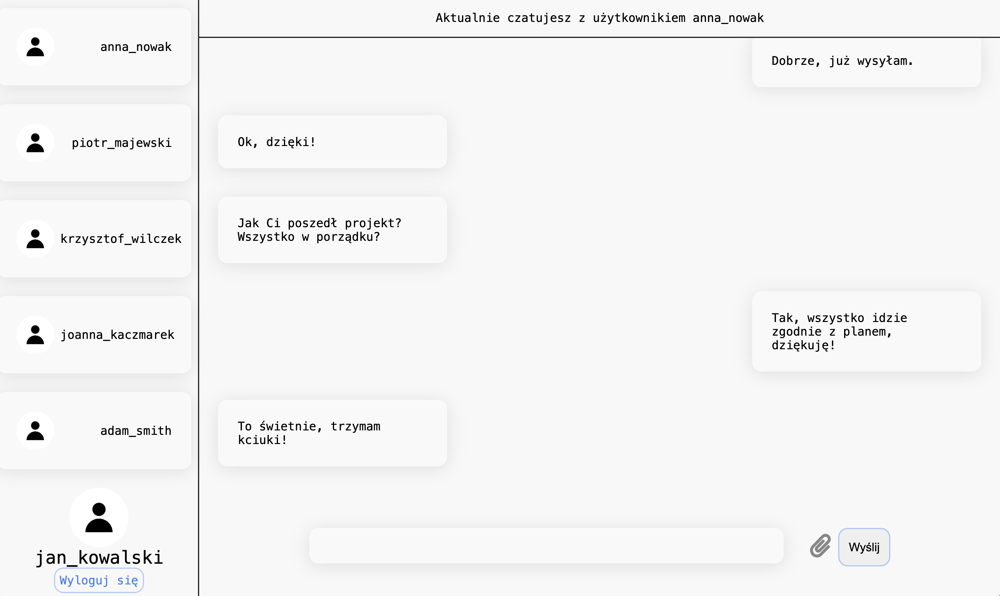
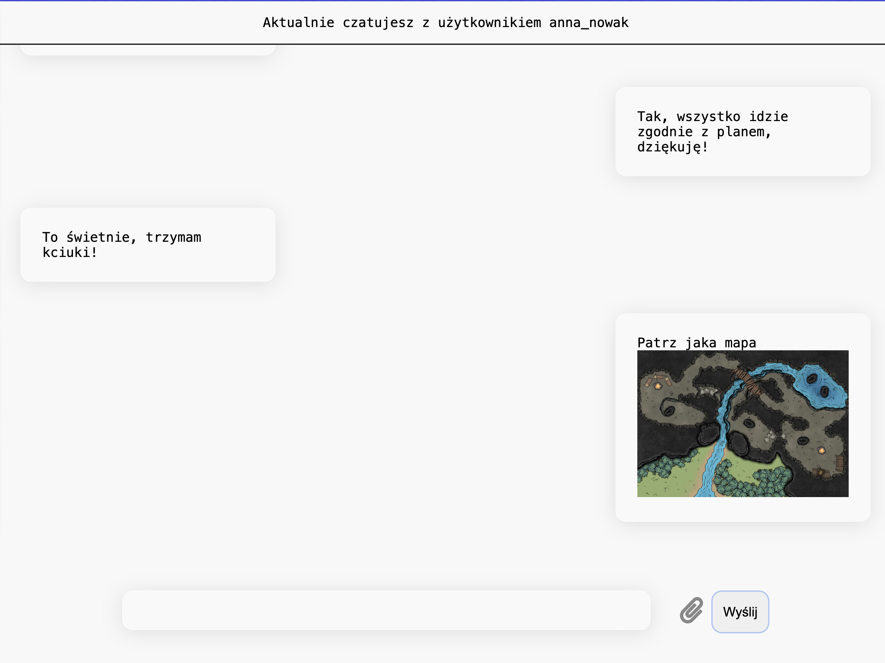

# BaseChat

BaseChat to nowoczesna aplikacja czatowa inspirowana wyglądem i funkcjonalnością popularnych komunikatorów, takich jak Messenger. Celem projektu jest umożliwienie użytkownikom wygodnej komunikacji w czasie rzeczywistym, dzięki intuicyjnemu i przyjaznemu interfejsowi.

---

## Funkcjonalności

- **Wiadomości w czasie rzeczywistym**: Dzięki technologii WebSocket wiadomości docierają do adresata natychmiastowo.
- **Nowoczesny interfejs**: Intuicyjna obsługa zapewniająca dynamiczne i płynne wrażenia użytkownika.
- **Historia czatu**: Bezpieczne przechowywanie rozmów z możliwością ich przeglądania w dowolnym momencie.
- **Wysyłanie plików**: Obsługa różnorodnych typów plików, takich jak MP4, MP3, PDF i inne.
- **Personalizacja profilu**: Użytkownicy mogą dostosować swoje profilowe zdjęcie w kilku prostych krokach.
- **Lista użytkowników online**: Szybki podgląd dostępnych kontaktów.

---

## Ekran logowania i rejestracji

Aplikacja BaseChat pozwala użytkownikom na szybkie logowanie lub rejestrację.
Poniżej znajduje się miejsce na dodanie zrzutów ekranu przedstawiających formularze logowania i rejestracji.

---

## Interfejs główny

Po zalogowaniu użytkownik zostaje przekierowany na główny ekran czatu, który jest podzielony na dwie sekcje:

1. **Lista użytkowników** (po lewej stronie)  
   Zawiera listę dostępnych użytkowników wraz z ich zdjęciami profilowymi, umożliwiając szybkie rozpoczęcie rozmowy.  

2. **Okno czatu** (po prawej stronie)  
   Tutaj wyświetla się aktualnie prowadzona rozmowa.

---

## Zmiana zdjęcia profilowego

Użytkownicy mogą w prosty sposób zmienić swoje zdjęcie profilowe. Wystarczy kliknąć nasze zdjęcie profilowe, wyświetlające się nad naszą nazwą uytkownika u i wybrać nowe zdjęcie.

---

## Czaty i wysyłanie wiadomości

### Wysyłanie wiadomości tekstowych  
W dolnej części okna czatu znajduje się pole tekstowe, w którym można wprowadzić wiadomość. Po jej wpisaniu wystarczy nacisnąć klawisz Enter, aby została natychmiast dostarczona do odbiorcy.

### Wysyłanie plików  
Obok pola tekstowego znajduje się ikona umożliwiająca dodanie plików do wiadomości. Aplikacja obsługuje niemal każdy typ pliku (np. MP4, MP3, PDF).  

- Jeśli przesyłany plik jest obsługiwany przez przeglądarkę, pojawi się jego podgląd w czacie.  
- W przypadku braku możliwości podglądu pliku, użytkownik otrzyma link do jego pobrania.  

**[Zrzut ekranu okna czatu z widocznymi wiadomościami i załącznikami]**

---

## Podsumowanie

BaseChat to narzędzie stworzone z myślą o prostocie, szybkości i niezawodności. Dzięki wykorzystaniu WebSocketów użytkownicy mogą cieszyć się błyskawiczną komunikacją, a intuicyjny interfejs sprawia, że aplikacja jest łatwa w obsłudze. Zapraszamy do korzystania z BaseChat i odkrycia pełni możliwości naszej aplikacji!